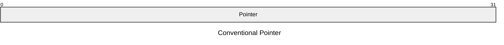
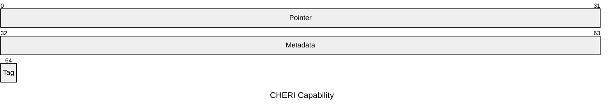

A capability is an unforgeable token of authority that grants particular rights to perform an action in an execution context.

In the CHERI context, a capability is a _fat pointer_ that includes not only a raw memory address, but also associated metadata for access permissions, bounds and pointer validity.

---

## In depth

<!-- Please note, this is extra content to be reviewed and to demonstrate what we can do with mermaid -->

On a typical computer (For example with x86_32 architecture), we use pointers. Pointers are typically just unsigned integers.

However, on a CHERI system, we use capabilities. You can understand these as pointers + metadata. They are bigger as a result - roughly double the size on an equivalent non-cheri system.

The metadata in question consists of a few parts:

- bounds
- permissions
- Object Type
- Validity tag bit

// insert diagram
